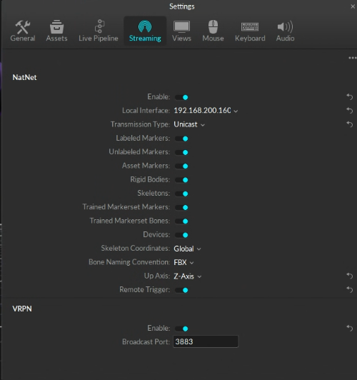

# GMR: General Motion Retargeting


  <a href="https://arxiv.org/abs/2505.02833">
    
  </a>
  <a href="https://opensource.org/licenses/MIT">
    
  </a>
  <a href="https://github.com/YanjieZe/GMR/releases">
    
  </a>
  <a href="https://x.com/ZeYanjie/status/1952446745696469334">
    
  </a>


Key features of GMR:
- Real-time high-quality retargeting, unlock the potential of real-time whole-body teleoperation, i.e., [TWIST](https://github.com/YanjieZe/TWIST).
- Carefully tuned for good performance of RL tracking policies.
- Support multiple humanoid robots and multiple human motion data formats (See our table below).

**NOTE: If you want this repo to support a new robot or a new human motion data format, send the robot files (`.xml` and meshes) / human motion data to <a href="mailto:lastyanjieze@gmail.com">Yanjie Ze</a> or create an issue, we will support it as soon as possible.**

This repo is licensed under the [MIT License](LICENSE).


# Demo

Retargeting LAFAN1 dancing motion to 5 different robots (Unitree G1, Booster T1, Stanford ToddlerBot, Fourier N1, and ENGINEAI PM01):


https://github.com/user-attachments/assets/23566fa5-6335-46b9-957b-4b26aed11b9e


# Supported Robots and Data Formats

| Robot/Data Format | SMPLX ([AMASS](https://amass.is.tue.mpg.de/), [OMOMO](https://github.com/lijiaman/omomo_release)) | BVH ( [LAFAN1](https://github.com/ubisoft/ubisoft-laforge-animation-dataset)) | FBX ( [OptiTrack](https://www.optitrack.com/)) | More formats coming soon | 
| --- | --- | --- | --- | --- |
| Unitree G1 `unitree_g1` | ✅ | ✅ | ✅ |
| Booster T1 `booster_t1` | ✅ |  ✅  | TBD | 
| Stanford ToddlerBot `stanford_toddy` | ✅ | ✅ | TBD |
| Fourier N1 `fourier_n1` | ✅ | ✅ | TBD |
| ENGINEAI PM01 `engineai_pm01` | ✅ | ✅ | TBD |
| More robots coming soon |


# Installation

The code is tested on Ubuntu 22.04/20.04.

```bash
# create conda env
conda create -n gmr python=3.10 -y
conda activate gmr

# install GMR
pip install -e .

# NOTE: after install SMPLX, change `ext` in `smplx/body_models.py` from `npz` to `pkl` if you are using SMPL-X pkl files.

# to resolve some possible rendering issues
conda install -c conda-forge libstdcxx-ng -y
```


# Data Preparation

[[SMPLX](https://github.com/vchoutas/smplx) body model] download SMPL-X body models to `assets/body_models` from [SMPL-X](https://smpl-x.is.tue.mpg.de/) and then structure as follows:
```bash
- assets/body_models/smplx/
-- SMPLX_NEUTRAL.pkl
-- SMPLX_FEMALE.pkl
-- SMPLX_MALE.pkl
```

[[AMASS](https://amass.is.tue.mpg.de/) motion data] download raw SMPL-X data to any folder you want from [AMASS](https://amass.is.tue.mpg.de/).

[[OMOMO](https://github.com/lijiaman/omomo_release) motion data] download raw OMOMO data to any folder you want from [this google drive file](https://drive.google.com/file/d/1tZVqLB7II0whI-Qjz-z-AU3ponSEyAmm/view?usp=sharing). And process the data into the SMPL-X format using `scripts/convert_omomo_to_smplx.py`.

[[LAFAN1](https://github.com/ubisoft/ubisoft-laforge-animation-dataset) motion data] download raw LAFAN1 bvh files from [the official repo](https://github.com/ubisoft/ubisoft-laforge-animation-dataset), i.e., [lafan1.zip](https://github.com/ubisoft/ubisoft-laforge-animation-dataset/blob/master/lafan1/lafan1.zip).


# Human/Robot Motion Data Formulation

To better use this library, you can first have an understanding of the human motion data we use and the robot motion data we obtain.

Each frame of **human motion data** is formulated as a dict of (human_body_name, 3d global translation + global rotation).

Each frame of **robot motion data** can be understood as a tuple of (robot_base_translation, robot_base_rotation, robot_joint_positions).


# Usage

## Retargeting from SMPL-X (AMASS, OMOMO) to Robot

**NOTE: after install SMPL-X, change `ext` in `smplx/body_models.py` from `npz` to `pkl` if you are using SMPL-X pkl files.**


Retarget a single motion:
```bash
# single motion
python scripts/smplx_to_robot.py --smplx_file <path_to_smplx_data> --robot <path_to_robot_data> --save_path <path_to_save_robot_data.pkl> --rate_limit
```
By default you should see the visualization of the retargeted robot motion in a mujoco window.
If you want to record video, add `--record_video` and `--video_path <your_video_path,mp4>`.
- `--rate_limit` is used to limit the rate of the retargeted robot motion to keep the same as the human motion. If you want it as fast as possible, remove `--rate_limit`.


Retarget a folder of motions:
```bash
python scripts/smplx_to_robot_dataset.py --src_folder <path_to_dir_of_smplx_data> --tgt_folder <path_to_dir_to_save_robot_data> --robot <robot_name>
```
By default there is no visualization for batch retargeting.


## Retargeting from BVH (LAFAN1) to Robot

Retarget a single motion:
```bash
# single motion
python scripts/bvh_to_robot.py --bvh_file <path_to_bvh_data> --robot <path_to_robot_data> --save_path <path_to_save_robot_data.pkl> --rate_limit
```
By default you should see the visualization of the retargeted robot motion in a mujoco window. 
- `--rate_limit` is used to limit the rate of the retargeted robot motion to keep the same as the human motion. If you want it as fast as possible, remove `--rate_limit`.


Retarget a folder of motions:
```bash
python scripts/bvh_to_robot_dataset.py --src_folder <path_to_dir_of_bvh_data> --tgt_folder <path_to_dir_to_save_robot_data> --robot <robot_name>
```
By default there is no visualization for batch retargeting.


## Retargeting from FBX (OptiTrack) to Robot

We provide the script to use OptiTrack MoCap data for real-time streaming and retargeting.

Usually you will have two computers, one is the server that installed with Motive (Desktop APP for OptiTrack) and the other is the client that installed with GMR.

Find the server ip (the computer that installed with Motive) and client ip (your computer). Set the streaming as follows:



And then run:
```bash
python scripts/optitrack_to_robot.py --server_ip <server_ip> --client_ip <client_ip> --use_multicast False --robot unitree_g1
```
You should see the visualization of the retargeted robot motion in a mujoco window.


## Visualize saved robot motion
```bash
python scripts/vis_robot_motion.py --robot <robot_name> --robot_motion_path <path_to_save_robot_data.pkl>
```
If you want to record video, add `--record_video` and `--video_path <your_video_path,mp4>`.


# Speed Benchmark

| CPU | Retargeting Speed |
| --- | --- |
| AMD Ryzen Threadripper 7960X 24-Cores | 60~70 FPS |
| 13th Gen Intel Core i9-13900K 24-Cores | 35~45 FPS |
| TBD | TBD |


# Citation

If you find our code useful, please consider citing our papers:

```bibtex
@article{ze2025twist,
title={TWIST: Teleoperated Whole-Body Imitation System},
author= {Yanjie Ze and Zixuan Chen and João Pedro Araújo and Zi-ang Cao and Xue Bin Peng and Jiajun Wu and C. Karen Liu},
year= {2025},
journal= {arXiv preprint arXiv:2505.02833}
}
```
and this github repo:
```bibtex
@software{ze2025gmr,
title={GMR: General Motion Retargeting},
author= {Yanjie Ze and João Pedro Araújo and Jiajun Wu and C. Karen Liu},
year= {2025},
url= {https://github.com/YanjieZe/GMR},
note= {GitHub repository}
}
```


# Acknowledgement
Our IK solver is built upon [mink](https://github.com/kevinzakka/mink) and [mujoco](https://github.com/google-deepmind/mujoco). Our visualization is built upon [mujoco](https://github.com/google-deepmind/mujoco). The human motion data we try includes [AMASS](https://amass.is.tue.mpg.de/), [OMOMO](https://github.com/lijiaman/omomo_release), and [LAFAN1](https://github.com/ubisoft/ubisoft-laforge-animation-dataset).
